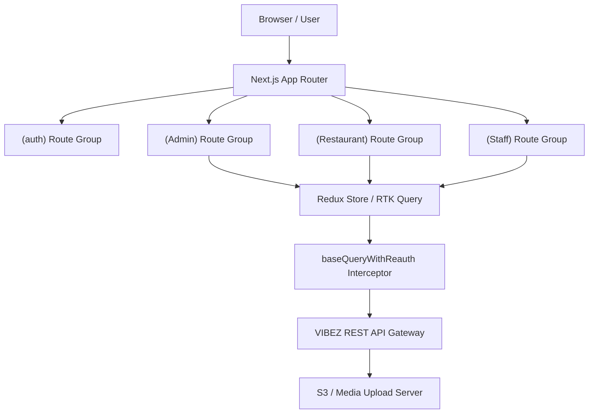

# VIBEZ - Restaurant Booking, Marketing & Marketplace Management Portal


VIBEZ is an enterprise-grade, modern SaaS platform designed to bridge the gap between restaurant entities, booking patrons, and marketing affiliate partners. The VIBEZ Portal enables platform administrators to control marketplace operations and lets restaurant owners manage daily floor operations, bookings, menus, marketing videos, staff scheduling, and performance analytics.

---

## 📖 Table of Contents
1. [System Architecture Overview](#-system-architecture-overview)
2. [Role-Based Feature Specifications](#-role-based-feature-specifications)
   - [Platform Administrators (Admin Portal)](#1-platform-administrators-admin-portal)
   - [Restaurant Owners (Restaurant Dashboard)](#2-restaurant-owners-restaurant-dashboard)
   - [Restaurant Staff Portal](#3-restaurant-staff-portal)
   - [Authentication & Account Recovery](#4-authentication--account-recovery)
3. [Technical Architecture & State Flow](#-technical-architecture--state-flow)
   - [State Management & RTK Query Engine](#1-state-management--rtk-query-engine)
   - [Seamless Re-Authentication Interceptor](#2-seamless-re-authentication-interceptor)
   - [Media & Upload Resolution Core](#3-media--upload-resolution-core)
4. [Tech Stack Matrix](#-tech-stack-matrix)
5. [Directory Layout](#-directory-layout)
6. [Local Setup & Environment Guide](#-local-setup--environment-guide)
   - [Prerequisites](#1-prerequisites)
   - [Environment Variables](#2-environment-variables)
   - [Installation & Execution](#3-installation--execution)
7. [Production Build & Deployment Guidelines](#-production-build--deployment-guidelines)
8. [Troubleshooting & FAQ](#-troubleshooting--faq)

---

## 🏗️ System Architecture Overview

VIBEZ operates on a split-portal layout powered by Next.js **App Router** groups. By isolating routes into layout groups like `(Admin)`, `(Restaurant)`, `(Staff)`, `(Home)`, and `(auth)`, the system separates layout contexts and limits bundle sizes per portal. Data hydration and synchronization are managed via an RTK-based centralized state store, maintaining a single source of truth across all modules.



---

## 🚀 Role-Based Feature Specifications

### 1. Platform Administrators (Admin Portal)
Administrators manage platform-wide configurations, billing models, listing verifications, and marketplace metrics.
- **Dynamic Stats Board**: Live tracking of overall platform revenue (Monthly vs. Annual), active subscribers, payment failures, upcoming renewals, and partner payout distributions using interactive charts.
- **Subscription Engine (`/admin/user-plans`)**: Create and update pricing structures (`MONTHLY`, `HALF_YEARLY`, `YEARLY`). Admins can toggle free trials, define trial day lengths, and manage billing plans.
- **Partner Referral & Commissions Ledger (`/admin/referrals`)**: Oversee affiliate codes, track referrers, calculate commission percentages (e.g. `percentOff` discounts), and manage manual withdrawal payouts.
- **Listing Onboarding & Moderation (`/admin/restaurants`)**: Audit restaurant listing submissions, suspend non-compliant owners, and manage category listings.
- **Users Management (`/admin/users`)**: Audit platform user accounts, toggle roles, inspect subscription statuses, and restrict unauthorized access.
- **System Coupons & Deals (`/admin/coupons` & `/admin/deals`)**: Setup platform-wide seasonal promotional campaigns, customize target discounts, and monitor usage metrics.
- **Payout Withdrawals (`/admin/withdrawals`)**: Review partner payout requests, verify banking details, process approvals, or reject flag transactions.

### 2. Restaurant Owners (Restaurant Dashboard)
A complete system for managing a physical restaurant branch and its online marketplace presence.
- **Analytics & Booking Visualizers (`/dashboard/analytics`)**: Live dashboard displaying reservations, peak booking hours, weekly visitor statistics, and customer metrics using responsive graphs.
- **Table Reservator & Calendar (`/dashboard/bookings`)**: Real-time management of reservation schedules, seating capacities, guest lists, and walk-in updates.
- **Short-Form Video Channels (`/dashboard/video`)**: Upload promotional short-form marketing videos ("Shorts") directly to the client feed to boost local customer interest.
- **Shift & Staff Scheduling (`/dashboard/staff` & `/dashboard/schedule`)**: Add staff members (Managers, Hosts, Waiters), assign shifts, manage work logs, and track staff schedules.
- **Performance Monitoring (`/dashboard/performance`)**: Key performance indicators, customer feedback scores, order processing turnaround times, and table turnover metrics.
- **Promotions & Deals (`/dashboard/deals`)**: Custom restaurant-specific dining offers, happy hour promos, and discount vouchers.
- **Restaurant Settings & Map Location (`/dashboard/settings`)**: Define restaurant location coordinates using map overlays (powered by React Leaflet) so users can locate venues easily.

### 3. Restaurant Staff Portal
- **Shift Calendars (`/staff`)**: Clean, lightweight visual workspace for on-duty staff to review assignations, shift duties, and operational task lists.
- **Reservation Check-ins**: Real-time booking check-in interface with table availability updates and status changes.

### 4. Authentication & Account Recovery
- **Multi-Role Authentication**: Dedicated authentication flows supporting Admin, Restaurant Owner, and Staff sign-in.
- **OTP Verification & Password Reset**: Secure password recovery via email-based OTP verification and token validation.

---

## 🔑 Technical Architecture & State Flow

### 1. State Management & RTK Query Engine
Query caching and state updates are handled by Redux Toolkit Query (`redux/api/baseApi.ts`). The API utilizes tags to optimize network traffic:
- **Core Tag Types**: `SubscriptionPlan`, `User`, `Deal`, `Restaurant`, `Coupon`, `Reservation`, `Dashboard`, `Withdrawal`, `Shorts`, `Staff`.
- **Query Mutators**: Mutations such as `createSubscriptionPlan` or `updateBooking` automatically mark tags as dirty (e.g. `invalidatesTags: ["SubscriptionPlan"]`), triggering background updates for dashboard lists without requiring a page reload.

### 2. Seamless Re-Authentication Interceptor
The platform handles JWT-based authentication securely through HTTP headers:
- If a query fails with a `401 Unauthorized` or `403 Forbidden` error, the custom re-auth handler (`baseQueryWithReauth`) pauses active queries, triggers a request to `/auth/refresh-token` (injecting refresh credentials), updates the Redux token store, and automatically retries the failed requests.
- If the token refresh process fails, the session state is purged, local storage is cleared, and the user is safely redirected to `/login`.

### 3. Media & Upload Resolution Core
Uploaded files (profile pictures, banners, restaurant shorts) are kept in backend storage and resolved using `getImageUrl()` (`lib/utils.ts`):
- Converts relative system filenames (e.g., `uploads/profile-images/...`) to absolute paths.
- Reads `NEXT_PUBLIC_PIC_URL` dynamically as the base asset domain while avoiding double-slash (`//`) errors.

---

## 🛠️ Tech Stack Matrix

| Layer | Technology | Purpose |
| :--- | :--- | :--- |
| **Framework** | [Next.js v16](https://nextjs.org/) | Core App Router framework, SSR, and path structures |
| **UI Core** | [React v19](https://react.dev/) | React 19 concurrent features and UI components |
| **State Engine** | [Redux Toolkit (v2)](https://redux-toolkit.js.org/) | Global store provider, auth token slice, and page parameters |
| **API Caching** | [RTK Query](https://redux-toolkit.js.org/rtk-query/overview) | Backend API sync layer, interceptors, and tags |
| **Data Visuals** | [Recharts](https://recharts.org/) | Custom revenue breakdowns, booking histograms, and stats |
| **Maps & Geoloc** | [React Leaflet](https://react-leaflet.js.org/) | Geographic coordinates picker and map visualizer |
| **Styling** | [Tailwind CSS v4](https://tailwindcss.com/) & Vanilla CSS | Performance-driven designs, components, and fluid responsiveness |
| **Realtime Sync** | [Socket.io Client](https://socket.io/) | Live table reservation statuses and check-in pushes |
| **Alerts & Toasts**| [Sonner](https://github.com/emilkowalski/sonner) & SweetAlert2 | Premium alerts, toasts, confirmations, and custom notifications |
| **Animations** | [Lottie React](https://github.com/gamertart/lottie-react) & Fast Marquee | Micro-animations and continuous smooth scroll visualizers |

---

## 📁 Directory Layout

```bash
vibez_restaurant/
├── app/
│   ├── (Admin)/            # Layout & pages exclusive to platform admins
│   │   ├── admin/          # Dashboard overview
│   │   │   ├── coupons/    # Platform promo coupons
│   │   │   ├── deals/      # System promotional deals
│   │   │   ├── referrals/  # Partner commission & affiliate ledger
│   │   │   ├── restaurants/# Listing moderation & onboarding
│   │   │   ├── settings/   # Platform settings
│   │   │   ├── user-plans/ # Subscription plan management
│   │   │   ├── users/      # Account & role administration
│   │   │   └── withdrawals/# Payout requests ledger
│   │   └── layout.tsx      # Admin dashboard root shell
│   ├── (Restaurant)/       # Layout & pages for restaurant owners
│   │   ├── dashboard/      # Restaurant owner management suite
│   │   │   ├── analytics/  # Revenue & booking stats
│   │   │   ├── bookings/   # Table reservation calendar & list
│   │   │   ├── deals/      # Restaurant deals & promos
│   │   │   ├── performance/# Operation metrics
│   │   │   ├── schedule/   # Roster & duty schedules
│   │   │   ├── settings/   # Venue profile & Leaflet map position
│   │   │   ├── staff/      # Staff account management
│   │   │   └── video/      # Short-form marketing video uploader
│   │   └── layout.tsx      # Owner dashboard root shell
│   ├── (Staff)/            # Pages for restaurant managers and service staff
│   │   └── staff/          # Shift schedule, check-ins & duty view
│   ├── (auth)/             # Auth layouts (login, register, forgot-password, verify-otp)
│   ├── (Home)/             # Public landing pages & consumer views
│   ├── Components/         # Shared UI design system & modular components
│   ├── globals.css         # Theme stylesheet, Tailwind layer, custom fonts
│   └── layout.tsx          # Root HTML metadata provider
├── redux/
│   ├── api/
│   │   └── baseApi.ts      # Main RTK Query interceptor with reauth and tag invalidation
│   ├── features/           # Modular RTK Query endpoints & slices
│   │   ├── admin/          # Subscription plan & admin API endpoints
│   │   ├── auth/           # Login credentials slice and token persistence
│   │   ├── coupon/         # Coupon CRUD operations
│   │   ├── dashboard/      # Analytics & dashboard metric queries
│   │   ├── deals/          # Deal & promotional endpoints
│   │   ├── reservations/   # Reservation endpoints
│   │   ├── restaurant/     # Venue details & map coordinates API
│   │   ├── shorts/         # Short-form video uploading & feed API
│   │   ├── staff/          # Staff scheduling & roster endpoints
│   │   └── user/           # User management API
│   └── store.ts            # Configured Redux state store
├── lib/
│   └── utils.ts            # Dynamic image resolvers & CSS class mergers (`cn`)
└── public/                 # Static illustrations, branding logos, icons
```

---

## ⚙️ Local Setup & Environment Guide

### 1. Prerequisites
- **Node.js**: `v18.0.0` or higher (Recommended: `v20.x`)
- **Package Manager**: `npm` (v9+) or `yarn` / `pnpm`

### 2. Environment Variables & Setup

Copy the template file `.env.example` to create your local `.env` file:

```bash
cp .env.example .env
```

#### Variable Breakdown:

| Variable | Description | Example / Default Value |
| :--- | :--- | :--- |
| `NEXT_PUBLIC_API_URL` | Base URL pointing to the VIBEZ REST API Gateway | `https://vibezapi.apponislam.top/api/v1` |
| `NEXT_PUBLIC_PIC_URL` | Base URL pointing to uploaded static assets, images, & shorts | `https://vibezapi.apponislam.top` |
| `NEXT_PUBLIC_MAPS_API_KEY` | Google Maps / Geolocation API Key for React Leaflet map position resolution | `AIzaSy...` |

> [!NOTE]
> All environment variables start with `NEXT_PUBLIC_` so they are accessible on both server-side rendered (SSR) pages and browser client components. Ensure you restart the development server (`npm run dev`) after modifying `.env`.

### 3. Installation & Execution
Follow these commands to install dependencies and run the application locally:

```bash
# 1. Install project dependencies
npm install

# 2. Start the development server with hot-reloading
npm run dev
```

Open [http://localhost:3000](http://localhost:3000) in your browser to access the portal.

---

## 📦 Production Build & Deployment Guidelines

### Code Linting & Verification
Before compiling the production package, verify code quality:
```bash
npm run lint
```

### Compiling Production Build
Compile your production package:
```bash
npm run build
```
This action builds static client pages, optimizes fonts, compiles TypeScript, and generates optimized assets in the `.next` directory.

### Launching Production Server
Run the production build:
```bash
npm start
```
*Port configuration can be customized by defining a `PORT` environment variable (e.g. `PORT=8080 npm start`).*

---

## ❓ Troubleshooting & FAQ

<details>
<summary><b>1. How are expired session tokens handled?</b></summary>
<p>The application automatically intercepts 401/403 responses via <code>redux/api/baseApi.ts</code>. It attempts a token refresh behind the scenes. If token renewal fails, state is reset and the user is redirected to <code>/login</code>.</p>
</details>

<details>
<summary><b>2. Images or uploaded videos fail to render. How to fix?</b></summary>
<p>Ensure <code>NEXT_PUBLIC_PIC_URL</code> is properly configured in your <code>.env</code> file. Check that <code>getImageUrl()</code> in <code>lib/utils.ts</code> receives a valid relative asset path.</p>
</details>

<details>
<summary><b>3. Leaflet Map container tiles are not rendering correctly.</b></summary>
<p>Ensure Leaflet CSS is imported in <code>globals.css</code> or the map component, and verify that <code>window</code> object checks are in place to support Next.js Server-Side Rendering (SSR).</p>
</details>

---
*Maintained by the VIBEZ Development Team.*

